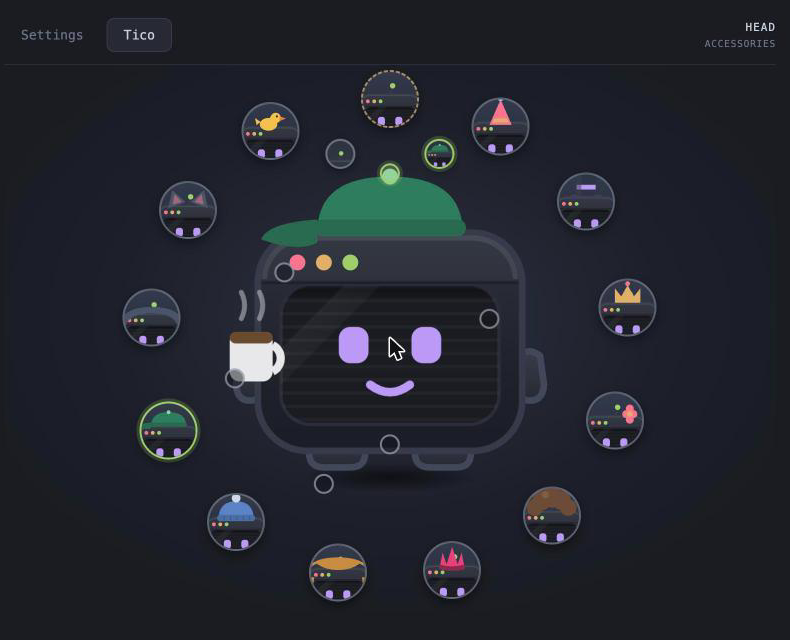

# tico

**A desktop pet that lives along the bottom of your screen, notices what you are
doing, and has opinions about it.**

[](https://github.com/fgrr12/tico/actions/workflows/build.yml)


He is a small terminal window with a face on its screen. He walks, sits, dozes
off when you stop moving the cursor, climbs onto the title bars of your windows,
falls off them, digs a burrow in the floor of your desktop and goes down it when
nobody is looking. He notices which application is in front and says something
about it. He knows what time it is, and 3am tico is a different creature from 9am
tico rather than the same one on a longer timer.

He came out of a terminal pane on his author's portfolio site, and now has
a real desktop under his feet.

## He is a state machine, not a chatbot

There was a local language model in here. It was built, wired up, given six
different attempts at a prompt that sounded like him, and then **removed** — the
whole argument is in [PLAN.md](PLAN.md). Every line he says is hand-written, and
everything he does is deterministic and instant.

That is not a limitation that had to be excused; it is the design. A pet that
freezes for two seconds while a token streams is worse than a pet that says less,
and 459 written lines in each of English and Spanish, picked by mood and hour and
how long he has known you, do not repeat themselves nearly as fast as you would
think.

**Nothing here talks to a network. There is no model, no account, no telemetry.**

## What is in him

- **42 behaviours** — pacing, stretching, hiccups, sneezes, chasing the cursor,
  standing on his head, going quiet and staring at nothing.
- **13 feelings on two axes.** Energy comes from the clock — there is a real
  post-lunch dip in the table — and it decides *how much* he does. The feeling
  decides *what kind*: a bored pet paces and stares, a pleased one hops and shows
  off, and you can tell which is which without being told.
- **A burrow** with three rooms, under a hatch in the floor. He goes home
  sometimes. He has a favourite chair down there, and it emerged rather than
  being chosen.
- **29 things he wears** for no reason he would explain — hats, hair, a monocle,
  wellies, a rubber duck he is very clear is there to be explained to. He picks
  one on a Tuesday afternoon and takes it off a minute later.
- **Reminders**, from a JSON file anything can write to.
- **English and Spanish**, everywhere, including his own voice.

## Dress him



**26 drawings across four slots — 1,620 bodies.** Press a part of him and a
submenu opens on it: change the *part* (nine shells, five pairs of hands, six
feet, six antennas) or the *accessory* on it. Accessories have a place, so a cap
and a coffee are not the same decision — he can wear one of each.

Anything you pin is a floor, not a lock: he still tries other things on over it,
and goes back to yours when they come off.

## What he remembers, and what he refuses to

He keeps a short history between sessions: distinct days he has been around, his
current and best run of consecutive days, how often he has been petted or picked
up, and which hat he has worn most — which gives him a favourite, which then
tilts what he reaches for.

**What that file does not contain is the point.** No application names, no window
titles, no track names, no timestamp finer than a date. Everything about what
*you* did stays in memory and dies with the process.

> A pet that remembers last Tuesday's app usage is a tracker wearing a costume.

Delete `memory.json` and he simply meets you again.

## Platforms

He **builds** on all three — every push compiles him on macOS, Windows and
Linux. He **runs** as a pet everywhere. He **notices** things only on macOS: the
six senses
(frontmost application, microphone, music, keystrokes, window ledges, window
titles) are behind `#[cfg(target_os = "macos")]` with fallbacks that return
nothing, so elsewhere he walks, talks, sleeps, dozes, wears hats, keeps his
burrow and reacts to you — but not to your desk.

| Platform              | Runs | Senses | Notes                                                        |
| --------------------- | ---- | ------ | ------------------------------------------------------------ |
| macOS                 | ✅   | ✅     | Tray-only, no Dock icon. The only one in daily use            |
| Windows 10/11         | ✅   | ❌     | Builds in CI. Needs the Win32 watchers                        |
| Linux / X11           | ✅   | ❌     | Builds in CI. Needs the X11/PulseAudio ones                   |
| Linux / KDE Wayland   | ⚠️   | ❌     | Also needs `wlr-layer-shell` to sit on the desktop            |
| Linux / GNOME Wayland | ❌   | ❌     | Mutter has no layer-shell, on purpose. XWayland or nothing    |

Two macOS-only tricks have no equivalent yet elsewhere: clicking him does not
take focus from what you are typing (he is converted to a non-activating
`NSPanel`), and he walks *over* the Dock rather than behind it. On Windows and
Linux he would sit on top like an ordinary always-on-top window.

**Help wanted, and it is well-shaped work:** each sense is one small file with
the macOS half already written and a stub next to it.

## Install

**[Download from Releases](../../releases)** — `.dmg` for macOS (Apple Silicon and
Intel), `.msi`/`.exe` for Windows, `.deb`/`.AppImage` for Linux. Every one of them
is built by CI on its own platform.

He is **not signed and will not be** — notarisation is $99/year to remove one
right-click, and at this size that is not a trade worth making. So each system
will complain once, and every release page carries the one command or the one
click that answers it. On macOS it is this, after copying him to `/Applications`:

```sh
xattr -d com.apple.quarantine /Applications/tico.app
```

Without it macOS says *"tico is damaged and can't be opened"*, which is its
unhelpful phrasing for "unsigned". The longer reasoning is in
[RELEASING.md](RELEASING.md).

## Build and hack on him

```sh
pnpm install
pnpm t:d      # run him
pnpm check    # 19 checks over the data, the drawings and the boundaries
```

Two things worth knowing before you change anything:

- **`pnpm dev` and open `/scripts/sheet.html`.** Every mood, every accessory,
  every body part, on a dark backdrop, at the sizes he is actually shown at.
  Nothing in a type or a lint catches a drawing that is wrong — a top hat filled
  with the colour of the desktop behind it survived all of them, twice. Looking
  at it catches it in a second. `/scripts/prefs.html` does the same for the
  settings window.
- **[PLAN.md](PLAN.md) is the argument, not the summary.** Every decision in it
  records what was tried and rejected and why, including the measurements that
  contradicted the reasoning. [CLAUDE.md](CLAUDE.md) is the short version of the
  rules that must hold.

## What he costs

**3.1% of one core awake, 0.6% asleep**, 229 MB across his four processes, 10 MB
on disk.

The gap between those first two numbers is the whole performance story. The price
of an always-on-top transparent overlay is *per composited frame over the whole
surface*, not per animated element — two little `z` text nodes left running while
he slept cost exactly what the entire pet costs. So when he sleeps, everything
stops, with no exceptions. Roughly 90% of the memory is the WebKit baseline any
app built this way pays before drawing anything.

## Licence

[MIT](LICENSE). Take him apart, put him back together differently, ship your own.

---

Built with [Tauri 2](https://tauri.app), React and a lot of hand-written SVG.
